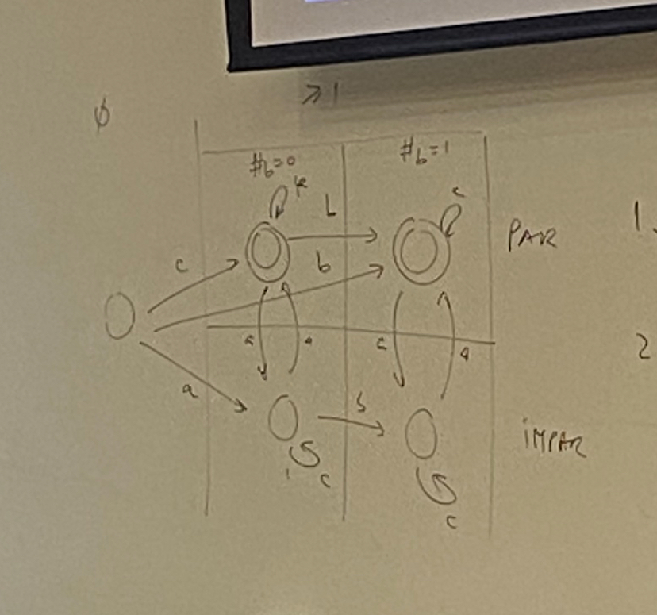

# Teste Modelo 1 Resolução

## Ex 1
Temos 3 Linguagens escritas de maneiras diferentes. Uma com um Autómato Finito (L1), outra por uma Gramática(L2), e a final por uma Expressão de Linguagem(L3).

### a)
Esta Alínea pede nos para analizar expressões e verificar se fazem parte da Linguagem 1.

A Linguagem 1 é definida por um Autómato Finito (M1) que é um Autómato Finito Não Determinista (NFA). 
Um Autómato Finito Não Determinista é definido pela capacidade de ter zero, uma ou mais transições para um dado par de estado e símbolo de entrada. Outra possibilidade de um Autómato deste tipo é incluir transições epsilon (ϵ), transições que permitem mudanças de estado sem consumir simbolos de entrada. O Estado 1 é o Estado inicial, demonstrado pela seta a apontar para o mesmo, mas este mesmo Estado tem de ser o final para a palavra ser reconhecida pela Linguagem, já que este estado está representado por 'double circle'.

#### Opção 1 - ab
'ab' existe na Linguagem 1

Estado 1 -> Estado 3 -> Estado 2 -> Estado 1

#### Opção 2 - abab
'abab' existe na Linguagem 1

Estado 1 -> Estado 3 -> Estado 2 -> Estado 1 -> Estado 3 -> Estado 2 -> Estado 1

#### Opção 3 - cabb
'cabb' não existe na Linguagem 1

Estado 1 -> Estado 2 -> Estado 1 -> Estado 3 -> Estado 2 -> Estado 3 (não consegue ir para estado 1)

#### Opção 4 - abcbb
'abcbb' existe na Liguagem 1

Estado 1 -> Estado 3 -> Estado 2 -> Estado 1 -> Estado 2 -> Estado 3 -> Estado 2 -> Estado 1

### b)
Esta Alínea pede nos para ver a expressão da Linguagem 3 e verificar se alguma das opções está CONTIDA na mesma.

Ao analizar a expressão no enunciado sabemos que qualquer cena que pertença a esta linguagem tem de começar com 'ab' e depois é seguido de pelo menos um 'c' (significado do m > 0) após isso tem de ser um número par de 'b's, ou nenhum.

#### Opção 1 - L(abcc* bb*)
Esta opção não é válida porque apesar de obrigar a que exista pelo menos um 'c', o que está correto, não permite que o número de b's seja nulo, tirando isso estaria correto. Isto porque se a Linguagem 3 está contida na da opção.

#### Opção 2 - L(abc* (bb)*)
Opção está correta. A Linguagem permite tudo que a Linguagem 3 precisa.

#### Opção 3 - L(abcc* (bb)*)
Opção correta.

#### Opção 4 - L(abc(c|bb)*)
Opção Correta também pela mesma razão da dois.

### c)
Agora temos de selecionar as gramáticas regulares da Linguagem 3. Uma gramática regular tem de ter apenas um simbolo não terminal em cada "entrada" e esse simbolo tem de estar no inicio ou no fim dos simbolos terminais.
Simbolos terminais (a, b, c); Simbolos não terminais (S, C, B)

#### Opção 1 - cima, esquerda
Errado, gramática não é regular. Tem dois simbolos não terminais.

#### Opção 2 - cima, direita
Errado, esta gramática exige a presença sempre de mais que um 'c', o que está incorreto.

#### Opção 3 - baixo, esquerda
Correto.

#### Opção 4 - baixo, direita
Errado, esta gramática não exige a presença de pelo menos um 'c'.

### d)
Para tornar o autómato M1, que é finito não-determinista, num determinista temos de fazeres umas shits:

Primeiro temos de ver as trânsições epsilon (ϵ) e basicamente juntar os estados com essas trânsições, neste caso o estado 1 e o estado 2.

Ficamos assim com dois estados {1,2} e {3}.
O estado {1,2} tem a transição de 'c' para si próprio e a de 'a' e 'b' para o estado {3}.
O estado {3} tem transição 'b' para {1,2} e as trânsições 'a' e 'c' para o vazio {}.

A tabela com as merdas e o coiso dos epsilons chega para ter cotação máxima.

ϵ(1) = {1}

ϵ(2) = {1, 2}

ϵ(3) = {3}

        | a | b | c |

    | 1 | 3 | 0 |1,2|

    | 3 | 0 |1,2| 0 |

    |1,2| 3 | 3 |1,2|

    | 0 | 0 | 0 | 0 |

0 indica nulo

1,2 = {1,2}

### e)
Para resolver este exercício temos primeiro de tornar a gramática de L2 em autómato.

S2 -> estado inicial

S2 -> a -> X
X -> b -> A
X -> b -> X1
X1 -> c -> X2
X2 -> b -> X
X -> b -> S2

A -> estado de aceitação

X1 e X2 criados para fazer a sequência bcb, para não ter uma espressão regular numa "etiqueta" de X para X, nós não queremos isto porque queremos um autómato não generlizado.

Exemplo de Não Generalizado:
X -> bcb -> X

Agora para concatenar as duas linguagens temos de alterar o estado 1 de M1 para deixar de ser o estado de aceitação e fazendo uma transição epsilon (ϵ) para o estado inicial da outra linguagem.

1 -> ϵ -> S2

Ter atenção para remover o double circle do 1 já que esse já não é um estado de aceitação!

### f)
O Objetivo desta alinea é obter uma expressão regular da L1, do autómato M1, antes de começar a fazer isso temos de verificar algumas coisas:
 - Garantir que o estado inicial não tem arcos de entrada
 - Garantir que o/os estados finais não têm arcos de saída

Para isso temos de fazer algumas alterações a M1

A -> ϵ -> 1

1 -> a -> 3

1 -> c -> 2

2 -> ϵ -> 1

2 -> b -> 3

3 -> b -> 2

1 -> ϵ -> B

Sendo A o estado inicial e B o estado final.

Para continuar o exercicio temos agora de ir estado a estado e removê-los. (Tentando começar pelo que tem menos trânsições)

Remover Estado 3:

A -> ϵ -> 1

1 -> (c | ab) -> 2

2 -> ϵ -> 1

1 -> ϵ -> B

2 -> bb -> 2

Remover Estado 2:

A -> ϵ -> 1

1 -> ϵ -> B

1 -> ((c | ab)(bb)*) -> 1

Remover Estado 3:

A -> (((c | ab)(bb)*)*) -> B

Done: Resolução = ((c|ab)(bb)*) *

### g) 
Mostrar que L3 está contido em L1

L3 = ab(c)+(bb)*

L1 = ((c|ab)(bb)*) *

Não sei resolver :((

## Ex 2

Aqui temos um alfabeto e uma linguagem.

A = {a, b, c}

R = {muita cena}

As condições presentes na Linguagem R são:
 - tamanho da "palavra" não pode ser nulo
 - o número de 'a's tem de ser par
 - só pode haver no máximo um 'b'

O autómato tem de ser finito, mas não generalizado.

Para tal vamos fazer o seguinte: 

